# Rendering Debug Sandbox

A small interactive graphics and physics sandbox built in C++ using OpenGL, GLFW, and ImGui.

This project combines:
- Rope physics simulation
- Software rasterization
- Z-buffer rendering
- Debug visualization tools
- Interactive rendering experiments

The goal of this project is to explore foundational computer graphics and simulation techniques inspired by GAMES101 and real-world rendering/debugging workflows.

---

# Features

## 1. Rope Simulation Module

- Euler integration
- Verlet integration
- Interactive solver switching
- Velocity visualization
- Simulation timing & FPS debug
- Real-time rope physics

### Euler Solver
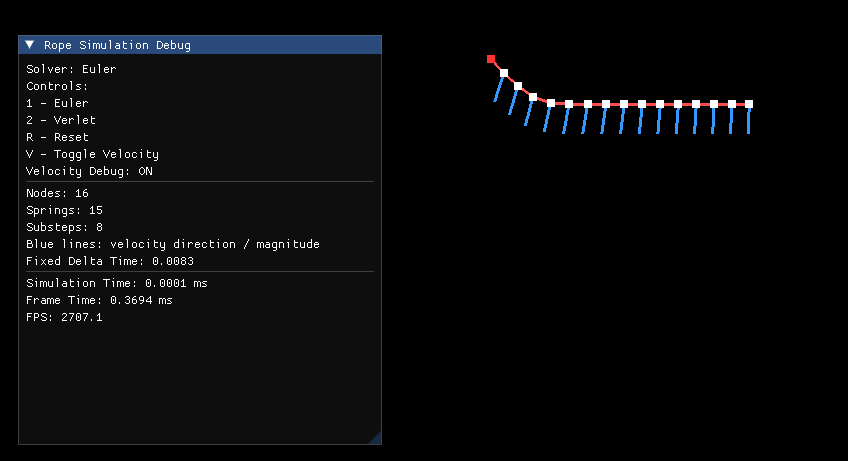

### Verlet Solver
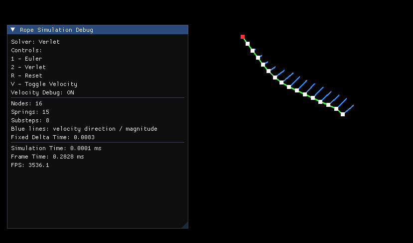

---

## 2. Software Rasterizer Module

Implemented fully on the CPU:

- Triangle rasterization
- Edge-function inside-triangle test
- Barycentric interpolation
- Z-buffer depth testing
- Wireframe rendering
- 2x2 MSAA anti-aliasing
- Interactive triangle rotation
- CPU framebuffer rendering
- Multiple debug visualization modes

---

# Rasterizer Debug Views

## Final Color
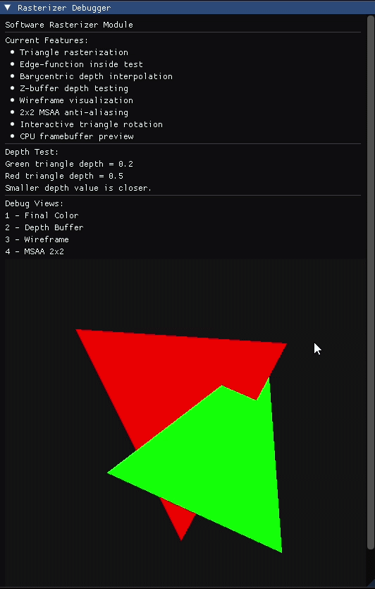

## Depth Buffer Visualization
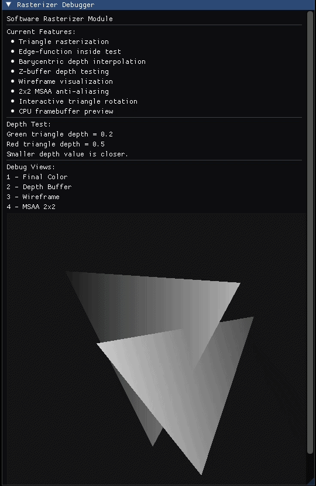

## Wireframe View
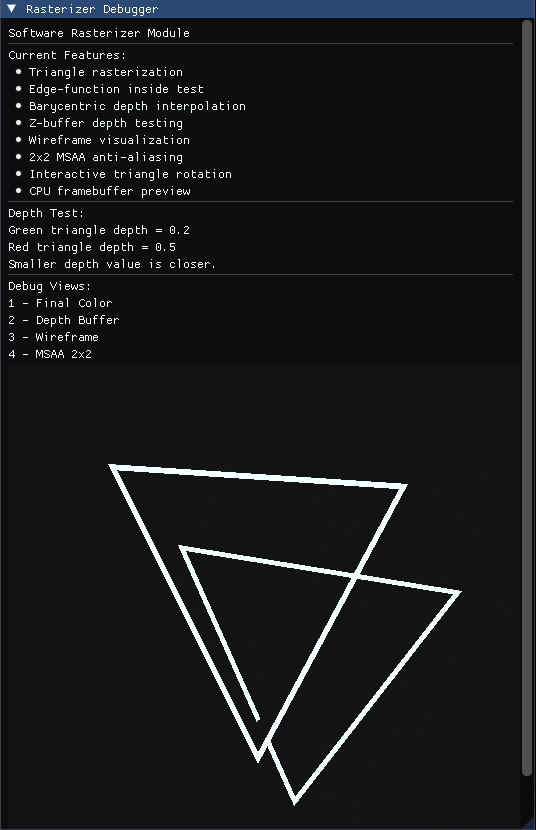

## 2x2 MSAA
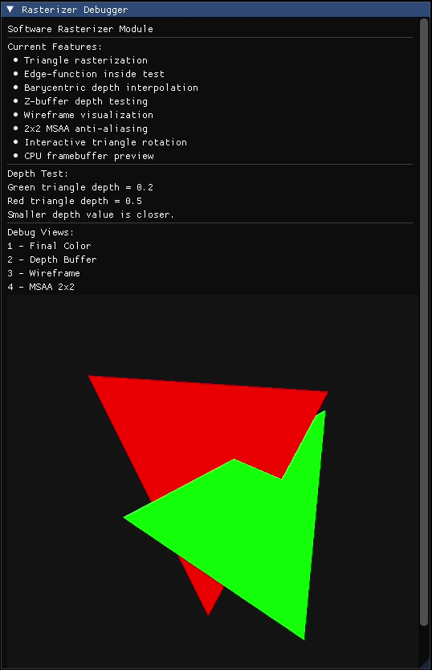

---

### 3. Model Renderer Debugger

An interactive OBJ model renderer based on Assignment 3 concepts, extended with runtime render modes and lighting controls.

**Features**
- OBJ model loading
- Interactive model rotation
- Zoom control
- OpenGL depth testing
- Wireframe rendering
- Normal visualization
- Lambert diffuse lighting
- Blinn-Phong shading
- UV visualization
- Texture mapping
- Texture nearest filtering
- Texture linear filtering
- Adjustable light direction
- ImGui render mode panel


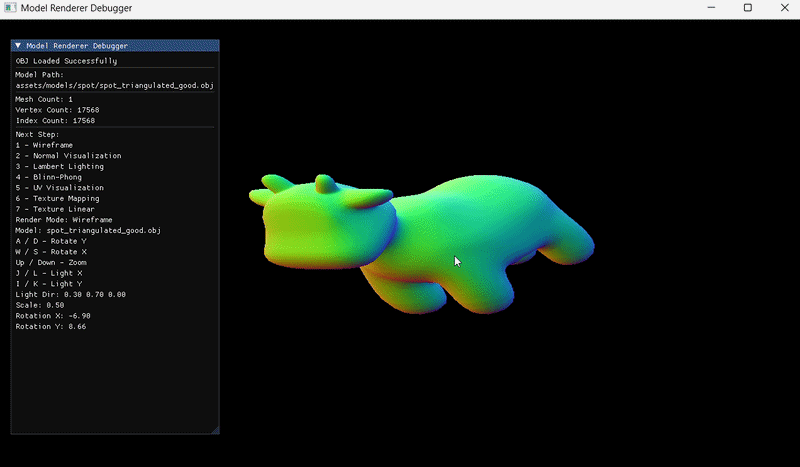
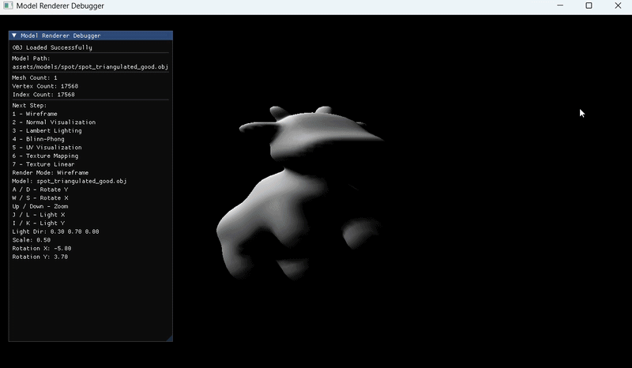
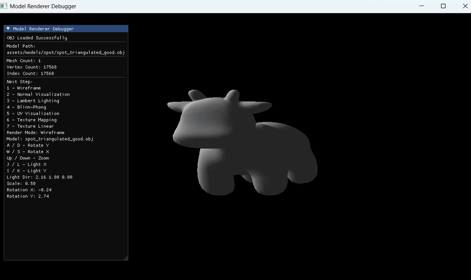
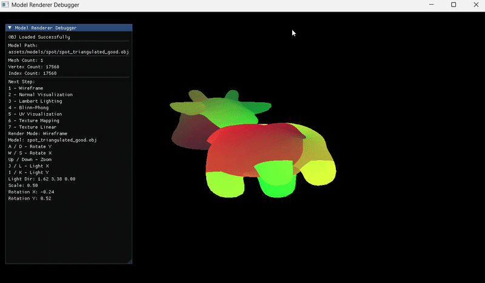
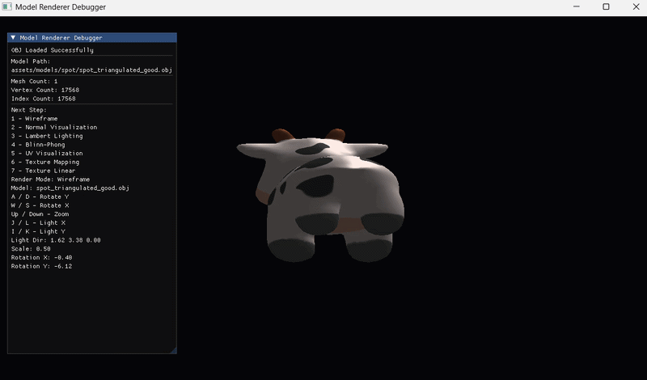
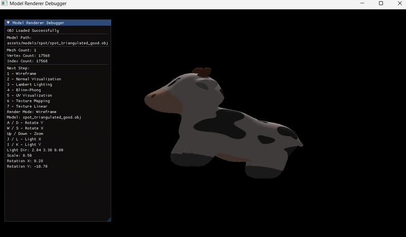

---

---

# CPU Path Tracing Renderer

A CPU-based Monte Carlo path tracing renderer implemented in C++.

The renderer supports:
- Recursive path tracing
- Global illumination
- Russian Roulette termination
- OBJ mesh loading
- BVH acceleration structure
- Multi-threaded rendering
- Cornell Box rendering
- Stress test benchmarking
- Benchmark comparison tools

Inspired by:
- PBRT
- GAMES101
- Offline rendering workflows

---

# Path Tracing Features

## Monte Carlo Global Illumination

Implemented recursive Monte Carlo path tracing with:
- Direct lighting
- Indirect diffuse bounce
- Recursive ray evaluation
- Russian Roulette optimization

---

## BVH Acceleration Structure

Implemented a CPU BVH acceleration structure including:
- Recursive BVH construction
- Bounding box intersection tests
- BVH traversal
- Closest-hit ray intersection

### BVH Benchmark

BVH ON/OFF comparison benchmark included.

| Mode | Time |
|---|---|
| BVH ON | 2.47 sec |
| BVH OFF | 2.88 sec |

### Profiling Breakdown

```txt
BVH Build : 0 ms
Path Trace / Ray Generation : 2461 ms
Framebuffer Write : 7 ms
Full Render : 2471 ms
```

### Analysis

The benchmark confirmed that BVH acceleration reduced scene traversal cost during path tracing.

The current benchmark scene contains 100 additional sphere objects and demonstrated a measurable performance improvement with BVH enabled.

The relatively modest speedup suggests that larger triangle-heavy scenes would benefit more significantly from acceleration structure traversal optimization.
---

### Thread Scaling Result

| Threads | Render Time |
|---|---:|
| 1 | 57.73s |
| 2 | 43.95s |
| 4 | 19.55s |
| 8 | 5.40s |

### Profiling Observation

The renderer demonstrated substantial performance improvements as CPU thread count increased.

The largest performance gain was observed between the 4-thread and 8-thread configurations, showing effective workload distribution during recursive ray tracing.

### Thread Scaling Benchmark

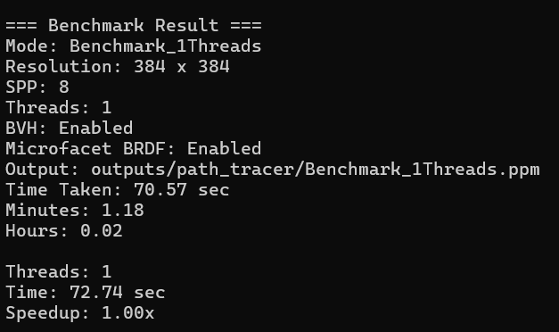
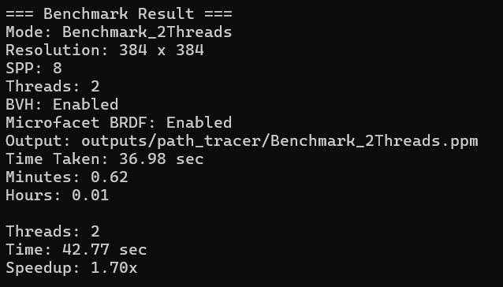
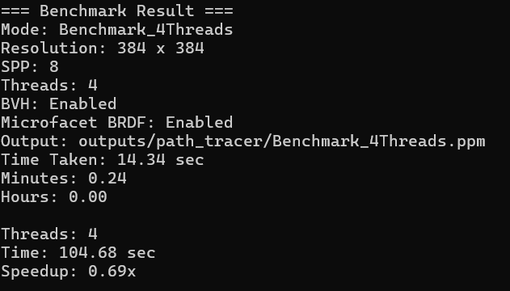
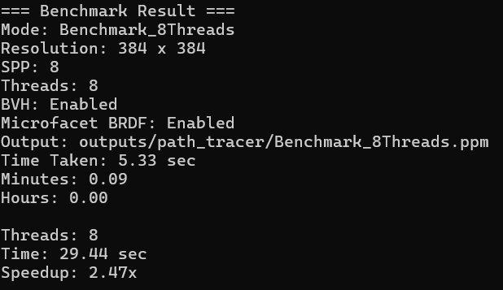


# Cornell Box Rendering

Implemented Cornell Box rendering using OBJ mesh loading.

### Progressive Preview (8 SPP)
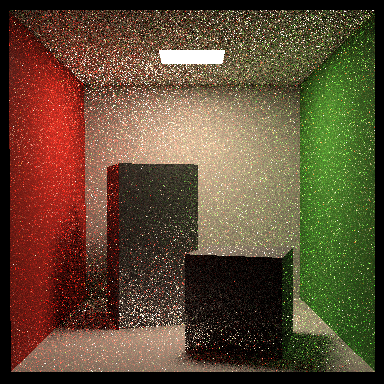

### High Quality Render (16 SPP)
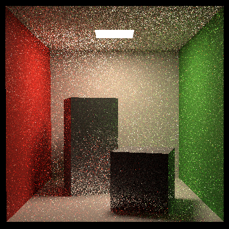

### Final Render (64 SPP)
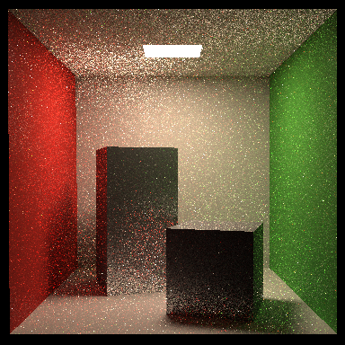

---

# Cornell Box Stress Test

Extended Cornell Box scene with additional sphere geometry to benchmark:
- BVH traversal
- Multi-threaded rendering
- Scene complexity scaling

### Stress Test Render
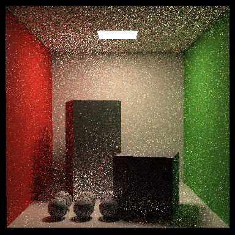

---

# Renderer Architecture

The renderer pipeline includes:
- Ray generation
- BVH traversal
- Triangle/sphere intersection
- Recursive light transport
- Monte Carlo sampling
- Multi-threaded framebuffer rendering

---

### Profiling Stages

The renderer includes internal timing instrumentation for:

- BVH construction
- Path trace / ray generation
- Framebuffer write
- Full render timing

Example runtime profiling output:

```txt
BVH Build : 0 ms
Path Trace / Ray Generation : 5390 ms
Framebuffer Write : 6 ms
Full Render : 5399 ms
```

---

# Benchmark Tools

The sandbox includes multiple renderer benchmark modes:

- Baseline Benchmark
- Progressive Preview
- High Quality Render
- Thread Scaling Benchmark
- BVH ON/OFF Benchmark
- Cornell Box Stress Test

---

# Technical Breakdown

## Rope Physics

The rope simulation supports both:
- Explicit Euler integration
- Verlet integration

The simulation includes:
- Spring constraints
- Gravity forces
- Pinned particles
- Real-time debug visualization

---

## Rasterization Pipeline

The software rasterizer includes:

### Triangle Rasterization
Triangles are rasterized on the CPU using edge functions.

### Inside-Triangle Test
Pixel coverage is determined using signed edge equations.

### Barycentric Interpolation
Depth values are interpolated per-pixel using barycentric coordinates.

### Z-Buffer
Per-pixel depth testing is implemented using a custom depth buffer.

### MSAA Anti-Aliasing
2x2 multi-sampling is implemented manually on the CPU.

### Debug Views
The renderer supports:
- Final Color
- Depth Buffer
- Wireframe

### Model Debug Views

The model renderer includes several runtime visualization modes similar to rendering debug tools:

- Wireframe
- Normal view
- UV view
- Lighting view
- Texture filtering comparison

---

# Controls

## Rope Simulation

| Key | Action |
|---|---|
| 1 | Euler Solver |
| 2 | Verlet Solver |
| R | Reset Rope |
| V | Toggle Velocity Visualization |

---

## Rasterizer

| Key | Action |
|---|---|
| 1 | Final Color |
| 2 | Depth Buffer |
| 3 | Wireframe |
| 4 | MSAA View |
| A | Rotate Triangle Left |
| D | Rotate Triangle Right |

---

## Model Renderer
| Key | Action |
|---|---|
| 1 | Wireframe |
| 2 | Normal visualization |
| 3 | Lambert lighting |
| 4 | Blinn-Phong shading |
| 5 | UV visualization |
| 6 | Texture nearest |
| 7 | Texture linear |
| A / D | Rotate Y axis |
| W / S | Rotate X axis |
| Up / Down | Zoom |
| J / L | Adjust light X |
| I / K | Adjust light Y |

---

---

## Path Tracing Renderer

| Key | Action |
|---|---|
| 1 | View Render Gallery |
| 2 | Baseline Benchmark |
| 3 | Progressive Preview |
| 4 | High Quality Render |
| 5 | Thread Benchmark Comparison |
| 6 | BVH ON/OFF Benchmark |
| 7 | Cornell Box Stress Test |
| 8 | Back |

---

## Benchmark Modes

| Mode | Description |
|---|---|
| Baseline Benchmark | Standard Cornell Box benchmark configuration |
| Progressive Preview | Fast low-SPP preview rendering |
| High Quality Render | Higher resolution final render |
| Thread Benchmark | Compare multi-threading performance |
| BVH Benchmark | Compare BVH enabled/disabled traversal |
| Cornell Stress Test | Cornell Box with additional sphere geometry |

# Build

## Requirements

- Visual Studio 2022
- CMake
- vcpkg
- OpenGL
- GLFW
- ImGui

## Build Instructions

```bash
mkdir build
cd build

cmake ..

cmake --build . --config Debug
```

Run:

```bash
.\Debug\RenderingDebugSandbox.exe
```

---

# Future Improvements

Planned future features include:

- SAH BVH construction
- Cook-Torrance microfacet BRDF
- Progressive accumulation rendering
- Tile-based rendering
- Environment map lighting
- GPU ray tracing experiments
- Vulkan/DXR renderer comparison

---

# Learning Goals

This project was built as a personal graphics engineering sandbox to better understand:

- Rendering pipelines
- Rasterization
- Depth buffering
- Anti-aliasing
- Simulation systems
- Graphics debugging workflows

Inspired by:
- GAMES101
- Graphics debugging tools
- Real-time rendering pipelines
